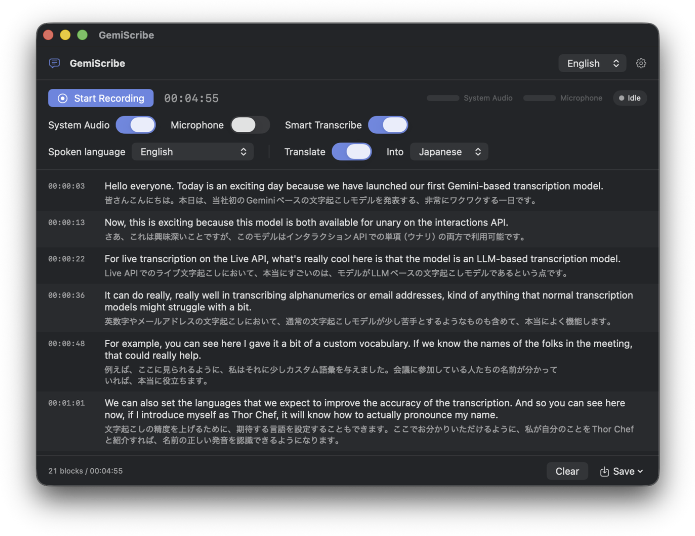

# GemiScribe

English | [日本語](README.md)

A macOS sample app for trying out the newly released **Gemini Transcribe Live**
(`gemini-3.5-transcribe-live`). It streams whatever your Mac is playing (meetings, videos, calls)
and/or your microphone to the Live API, splits the transcript into timestamped blocks at sentence
boundaries, and translates each block.



## Features

- **System audio and microphone, toggled independently.** System audio only by default; both can be
  switched while recording
- **Sentence-level blocks with timestamps** (`HH:MM:SS`), taken from the segment timing the server
  reports, so network latency does not shift them
- **Spoken-language selection.** Auto-detect, or fix it to Japanese, English, Japanese+English, Korean,
  Chinese, Spanish, French, German, Portuguese, Italian, Russian, Hindi, Thai, Vietnamese or Indonesian.
  Fixing the language makes names and jargon noticeably more stable
- **Smart transcription** (Gemini's `SMART` mode): removes fillers and formats punctuation, numbers and
  email addresses
- **Custom vocabulary** for names and in-house terms
- **Per-block translation** into Japanese or English. Blocks are translated once they close on a sentence,
  which keeps the output stable. Turn it off and translation costs nothing
- **UI in Japanese or English**, switchable at runtime
- **Export as Markdown or JSON**
- **Recording continues across the 10-minute connection cap.** The next socket is opened ahead of time and
  the switch happens between sentences

## Requirements

- macOS 15 or later (developed on macOS 26 / Xcode 26)
- A Gemini API key — <https://aistudio.google.com/apikey>

## Build and run

```bash
xcodebuild -project GemiScribe.xcodeproj -scheme GemiScribe -configuration Debug build
open build/Debug/GemiScribe.app
```

The app is written to `build/Debug/GemiScribe.app` inside the project (intermediates go to
`build/Intermediates/`). Opening `GemiScribe.xcodeproj` in Xcode and pressing ⌘R builds to the same place.

Tests:

```bash
xcodebuild test -project GemiScribe.xcodeproj -scheme GemiScribe -destination 'platform=macOS'
```

Launching with debug logging records every Live API frame in the unified log:

```bash
open build/Debug/GemiScribe.app --args --debug
/usr/bin/log show --predicate 'subsystem == "jp.namio.GemiScribe"' --last 30m --style compact --info
```

### Code signing

The project uses manual signing with a `DEVELOPMENT_TEAM`. To build on another Mac or Apple ID, set
`DEVELOPMENT_TEAM` in the project's build settings to your own team ID (the `OU=` value from
`security find-certificate -c "Apple Development" -p | openssl x509 -noout -subject`). Signing with a stable
certificate also stops macOS from asking for screen-recording permission after every rebuild.

## Getting started

1. Open ⚙ in the top right and enter your **Gemini API key** (stored in the Keychain). "Test connection"
   verifies it.
2. Set **Spoken language** to match the audio. For mixed material use "Japanese + English" or auto-detect.
3. Turn on **Smart Transcribe** and **Translate** if you want them, and pick the target language.
4. Choose the audio sources and press **Start Recording**. macOS asks for permission the first time:
   - System audio → **Screen Recording** (a ScreenCaptureKit requirement; only a 2×2-pixel video frame is captured)
   - Microphone → **Microphone**
5. If nothing appears, look at the level meters. No movement means a permission or device problem; movement
   without text means the API side.
6. **Save** exports Markdown or JSON.

Spoken language and smart transcription are part of the connection setup, so changes take effect from the
next recording.

## Output formats

### Markdown

Source text and translation as `-` list items; source only when translation is off.

```markdown
# GemiScribe Transcript

- Recorded: 2026-09-05 22:24:23 (JST)
- Duration: 00:02:27
- Audio sources: System audio
- Model: gemini-3.5-transcribe-live (SMART)
- Translation: Japanese (gemini-3.5-flash-lite)

## [00:00:03]
- Hello everyone. Today is an exciting day because we have launched our first Gemini-based transcription model.
- 皆さんこんにちは。本日は、Gemini ベースの初めての文字起こしモデルをリリースしたため、非常にエキサイティングな一日です。
```

### JSON

```json
{
  "app": "GemiScribe",
  "version": 1,
  "recordedAt": "2026-09-05T22:24:23+09:00",
  "durationSec": 147.8,
  "sources": ["system"],
  "transcription": { "model": "gemini-3.5-transcribe-live", "mode": "SMART", "languageCodes": ["en-US"] },
  "translation": { "enabled": true, "targetLanguage": "ja", "model": "gemini-3.5-flash-lite" },
  "blocks": [
    {
      "index": 0,
      "startSec": 3.12,
      "endSec": 12.6,
      "startTimecode": "00:00:03",
      "text": "Hello everyone. Today is an exciting day because we have launched our first Gemini-based transcription model.",
      "detectedLanguage": "en-US",
      "translation": "皆さんこんにちは。本日は、Gemini ベースの初めての文字起こしモデルをリリースしたため、非常にエキサイティングな一日です。"
    }
  ]
}
```

## How it works

```
SystemAudioCapture (ScreenCaptureKit, 48k stereo) ┐
                                                  ├─→ AudioMixer ─→ 16 kHz mono PCM16, 100 ms chunks
MicrophoneCapture (AVCaptureSession)              ┘        │
                                                           ├─→ SpeechActivityDetector (fallback VAD, stats)
                                                           ▼
                                                  SessionCoordinator ─→ LiveTranscriptionClient (WebSocket)
                                                           │  ← voiceActivity → BlockTimestamper
                                        interim → "listening…" row / final → BlockAssembler → translation
```

These are the behaviours of the Live API we ran into, and what the app does about them.

**Timestamps come from the server's segment notifications.** There are no word-level times, but
`voiceActivity` (`ACTIVITY_START` / `ACTIVITY_END`) reports where each segment begins and ends as an offset
into the audio sent on that connection. The app remembers the recording time of the first chunk it sent on
each connection and adds the offset. The clock is "samples sent ÷ 16000", so network latency never shifts
it. Without a notification it falls back to a local RMS-based VAD, and failing that to the audio clock
(`BlockTimestamper`).

**Finalization is forced at sentence ends.** On material that never goes quiet — a video, a news
programme — the server's VAD never closes a turn, and the partial just keeps growing. So once a partial
has been open for 8 seconds and ends on sentence punctuation, the app sends `audioStreamEnd` to finalize it;
without a sentence end it forces one at 25 seconds. Nothing is sent during silence. If no final comes back,
the boundary is resent once after 3 seconds and the connection replaced after 15 (`TurnBoundaryPolicy`).
The service discards audio that arrives right after a boundary — the gap between its own `ACTIVITY_END`
and the next `ACTIVITY_START` never measured below 0.32 s in any recording. So audio after a boundary is
held for 0.5 s, and the stream is padded ahead of it with 0.4 s of silence plus a 0.2 s replay of the audio
just before the boundary: the padding takes the discard and the first words of the next sentence survive.
The padding is subtracted from the server's offsets again.

**Words SMART mode drops right after a boundary are restored from the partial.** A boundary forced
mid-speech starts the next segment a word or two into a sentence. The partials carry those words, but the
smart-formatted final treats a segment that opens mid-sentence as a false start and begins at the next
clean sentence. The short, sentence-closing head is taken from the last partial and put back in front of
the final (`SeamRepair`).

**A word repeated across a seam is trimmed.** The tail of the padding sent after a boundary is
occasionally transcribed, putting the same word in both blocks. When the previous block was left
mid-sentence, up to three repeated leading words are dropped from the next one (`SeamRepair`).

**Repeats of the previous segment are stripped from partials.** The service often begins the next
segment's partials with the previous partial plus the few words that were in flight when the boundary
landed. Shown as-is, the "listening…" row repeats the block above it, and salvaging such a partial after a
dropped connection duplicates the block outright. A fuzzy prefix match removes it (`InterimCleaner`).

**Blocks cut mid-sentence are rejoined, and re-split at sentence ends when they grow long.** The
server's boundaries land mid-sentence on breaths and forced cuts. A turn that follows a block with no
sentence end is merged into it, and the few in-flight words at the end of a final are detached into the
next open block. Only blocks over 60 seconds are split, on sentence boundaries (`BlockAssembler`).

**Connections die after about 10 minutes, so a new one is made before that.** At 8m30s (or on
`goAway`) the next WebSocket is opened, and once it reports `setupComplete` the audio switches over **at a
moment when no turn is open**. The last 0.3 s of audio is replayed to the new socket, and the old one is
kept for 6 seconds to collect its final. If the server resets the connection, the app reconnects within
half a second and keeps the unfinalized partial as a block (`SessionCoordinator`). `sessionResumption` is
requested, but the transcription-only model issues no handles, so every connection is effectively a new
session.

**Smart transcription is Gemini's own feature.** The setup message's `inputAudioTranscription.mode` is
set to `VERBATIM` or `SMART`. The paragraph breaks SMART inserts are folded into one line per block.

**Translation is per block, sent in batches.** One request per block hits the free tier's request cap
within minutes, so finalized blocks are collected for a few seconds and translated in one request, and a
429 pauses the queue for as long as the service asks. Passing neighbouring blocks as context was tried and
dropped: the context kept leaking into the answer. Only blocks that end on a sentence are sent, so no block
is translated twice (`TranslationService`).

**The microphone is captured with AVCaptureSession**, because `AVAudioEngine.installTap` sometimes never
fires on recent macOS with Bluetooth input.

## Known limitations

- No speaker diarization: the Live API does not support it, and both sources are mixed into one stream.
- No word-level timestamps, only per block (per speech segment).
- With both sources on, the transcript cannot be split by source.
- Even when a boundary is aimed at a sentence end, the final includes about 0.3 s of words spoken after
  the request. Those words carry over into the next block, so sentences stay intact, but block boundaries
  can be off by a few words.
- A word occasionally lands in both blocks at a seam. The de-duplication compares words, so two
  spellings of the same word ("it will" and "We'll") are not recognized as a repeat.
- In smart mode a disfluency dropped from a final is sometimes restored from the partial. It really was
  spoken, but it is not what the formatting was asked to produce.
- Misrecognized proper nouns are a model behaviour; custom vocabulary and a fixed spoken language help.
