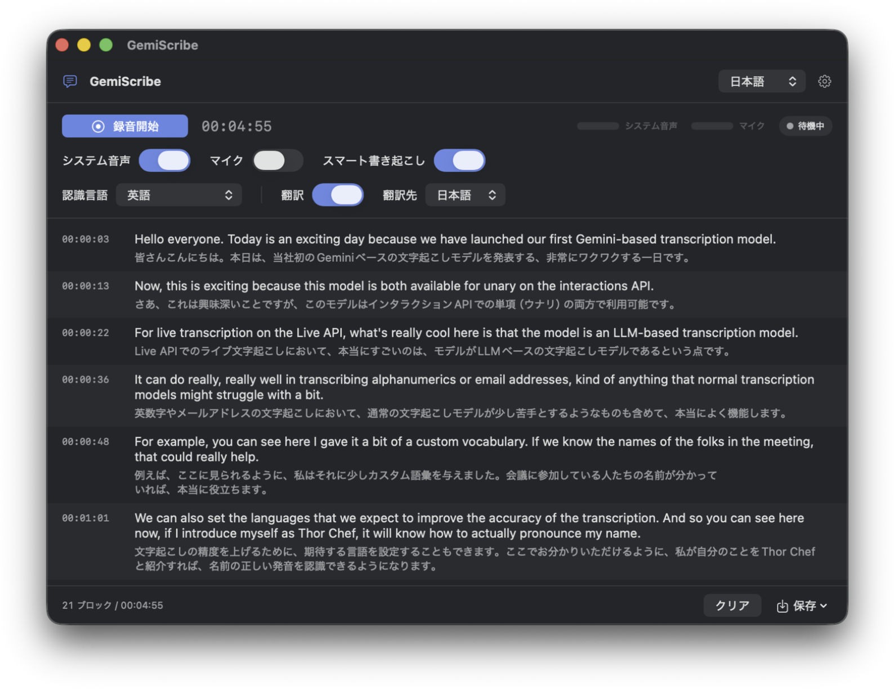

# GemiScribe

[English](README.en.md) | 日本語

**Gemini Transcribe Live**（`gemini-3.5-transcribe-live`）が新たにリリースされたので、それを試してみるための
macOS サンプルアプリです。Mac が再生している音声（会議・動画・通話）やマイクの音声を Live API に
ストリーミングし、文の切れ目でブロックに分けてタイムスタンプと翻訳を付けます。



## できること

- **システム音声とマイクを個別に ON/OFF**。既定はシステム音声のみ。録音中でも切り替えられます
- **文単位のブロック分割とタイムスタンプ**（`HH:MM:SS`）。サーバーが返す発話区間の情報を使うので、
  ネットワーク遅延の影響を受けません
- **認識言語の指定**。自動判定のほか、日本語 / 英語 / 日本語+英語 / 韓国語 / 中国語 / スペイン語 / フランス語 /
  ドイツ語 / ポルトガル語 / イタリア語 / ロシア語 / ヒンディー語 / タイ語 / ベトナム語 / インドネシア語。
  固定すると固有名詞の認識が安定します
- **スマート書き起こし**（Gemini の `SMART` モード）。フィラーを取り除き、句読点や数字・メールアドレスを整えます
- **カスタム語彙**。人名や社内用語を登録して認識を補正します
- **ブロックごとの自動翻訳**（日本語 / 英語）。文単位で閉じたブロックを訳すので訳文が安定します。
  OFF にすれば翻訳の課金はゼロです
- **UI 言語は日本語 / English** を実行時に切り替え
- **Markdown / JSON で保存**
- **10 分の接続上限を越えて録音を継続**。切れる前に次の接続を用意し、文の切れ目で切り替えます

## 必要なもの

- macOS 15 以降（開発は macOS 26 / Xcode 26）
- Gemini API キー — <https://aistudio.google.com/apikey>

## ビルドと実行

```bash
xcodebuild -project GemiScribe.xcodeproj -scheme GemiScribe -configuration Debug build
open build/Debug/GemiScribe.app
```

成果物はプロジェクト内の `build/Debug/GemiScribe.app` に出ます（中間生成物は `build/Intermediates/`）。
Xcode で `GemiScribe.xcodeproj` を開いて ⌘R でも同じ場所に出ます。

テスト:

```bash
xcodebuild test -project GemiScribe.xcodeproj -scheme GemiScribe -destination 'platform=macOS'
```

設定画面の下部に、実行中のビルドのバージョン・コミットハッシュ・ビルド日時が出ます。ハッシュ末尾の
`+` は、コミットされていない変更を含むビルドという意味です。再ビルド後にアプリを起動し直したか
迷ったときはここを見てください。

デバッグログ付きで起動すると、Live API とのやり取りが統一ログに残ります:

```bash
open build/Debug/GemiScribe.app --args --debug
/usr/bin/log show --predicate 'subsystem == "jp.namio.GemiScribe"' --last 30m --style compact --info
```

### 署名について

`DEVELOPMENT_TEAM` を指定した手動署名です。別の Mac や Apple ID でビルドする場合は、プロジェクトの
ビルド設定で `DEVELOPMENT_TEAM` を自分のチーム ID に変えてください
（`security find-certificate -c "Apple Development" -p | openssl x509 -noout -subject` の `OU=` の値）。
安定した証明書で署名しておくと、リビルドのたびに画面収録の許可を求められずに済みます。

## 使い方

1. 右上の ⚙ から **Gemini API キー**を入力します（キーチェーンに保存）。「接続テスト」で確認できます。
2. **認識言語**を話されている言語に合わせます。混在する場合は「日本語+英語」か「自動判定」。
3. 必要なら**スマート書き起こし**と**翻訳**を ON にし、翻訳先を選びます。
4. 音声ソースを選んで**録音開始**。初回は macOS が権限を求めます。
   - システム音声 → **画面収録**（ScreenCaptureKit の制約。映像は 2×2 ピクセルしか取得しません）
   - マイク → **マイク**
5. 文字が出ないときはレベルメーターを見てください。振れていなければ権限かデバイスの問題、
   振れているのに文字が出なければ API 側の問題です。
6. **保存**から Markdown か JSON を書き出します。

認識言語とスマート書き起こしは接続時に決まるため、変更は次の録音から反映されます。

## 保存形式

### Markdown

原文と翻訳を `-` のリストで並べます。翻訳 OFF のときは原文のみです。

```markdown
# GemiScribe 文字起こし

- 日時: 2026-09-05 22:24:23 (JST)
- 長さ: 00:02:27
- 音声ソース: システム音声
- モデル: gemini-3.5-transcribe-live (SMART)
- 翻訳: 日本語 (gemini-3.5-flash-lite)

## [00:00:03]
- Hello everyone. Today is an exciting day because we have launched our first Gemini-based transcription model.
- 皆さんこんにちは。本日は、Gemini ベースの初めての文字起こしモデルをリリースしたため、非常にエキサイティングな一日です。
```

### JSON

```json
{
  "app": "GemiScribe",
  "version": 1,
  "recordedAt": "2026-09-05T22:24:23+09:00",
  "durationSec": 147.8,
  "sources": ["system"],
  "transcription": { "model": "gemini-3.5-transcribe-live", "mode": "SMART", "languageCodes": ["en-US"] },
  "translation": { "enabled": true, "targetLanguage": "ja", "model": "gemini-3.5-flash-lite" },
  "blocks": [
    {
      "index": 0,
      "startSec": 3.12,
      "endSec": 12.6,
      "startTimecode": "00:00:03",
      "text": "Hello everyone. Today is an exciting day because we have launched our first Gemini-based transcription model.",
      "detectedLanguage": "en-US",
      "translation": "皆さんこんにちは。本日は、Gemini ベースの初めての文字起こしモデルをリリースしたため、非常にエキサイティングな一日です。"
    }
  ]
}
```

## 仕組み

```
SystemAudioCapture (ScreenCaptureKit, 48k stereo) ┐
                                                  ├─→ AudioMixer ─→ 16 kHz mono PCM16, 100 ms チャンク
MicrophoneCapture (AVCaptureSession)              ┘        │
                                                           ├─→ SpeechActivityDetector（予備の VAD・統計）
                                                           ▼
                                                  SessionCoordinator ─→ LiveTranscriptionClient (WebSocket)
                                                           │  ← voiceActivity → BlockTimestamper
                                        interim → 「聞き取り中」行 / final → BlockAssembler → 翻訳
```

Live API を実際に使ってみて分かった挙動と、それに合わせた設計を書いておきます。

**タイムスタンプはサーバーの区間通知から取る。** 単語レベルの時刻は返ってきませんが、`voiceActivity`
（`ACTIVITY_START` / `ACTIVITY_END`）でセグメントの開始と終了が「その接続に送った音声の先頭からの秒数」で
届きます。接続ごとに最初のチャンクの録音時刻を控えておき、オフセットを足して使います。基準は
「送出したサンプル数 ÷ 16000」なので、ネットワーク遅延で時刻がずれません。通知が来ないときは
ローカルの RMS ベース VAD、それもなければ音声クロックにフォールバックします（`BlockTimestamper`）。

**確定は文末を狙って強制する。** 動画やニュースのように途切れない音声では、サーバー VAD は一度も
ターンを閉じず、部分結果が伸び続けるだけになります。そこで部分結果が 8 秒以上続いて末尾が文末記号
（。．.!?）になった瞬間に `audioStreamEnd` を送って確定させ、文末が来なければ 25 秒で強制します。
無音中は何も送りません。確定が返らなければ 3 秒で一度だけ再送し、15 秒で接続を作り直します
（`TurnBoundaryPolicy`）。区切りの直後の音声はサーバーに捨てられます。サーバー自身が返す
`ACTIVITY_END` と次の `ACTIVITY_START` の差は、どの録音でも 0.32 秒を下回りませんでした。そこで区切り後の
音声は 0.5 秒ためたうえで、先に 0.4 秒の無音と、区切り直前 0.2 秒ぶん（すでに文字起こし済み）の音声を
送ってから流します。捨てられる区間をこの詰め物が埋めるので、次の文の最初の語が残ります。詰め物のぶん
サーバー側の時刻が進むので、その分は差し引いています。

**SMART モードが落とす区切り直後の語を部分結果から復元する。** 文の途中で強制区切りが入ると、次のセグメントは
文の途中から始まります。部分結果にはその語が入っていますが、SMART モードの確定は「言い直し」とみなして次の
文頭から始めてしまいます。確定直前の部分結果から、文末記号で終わる短い先頭断片だけを取り出して確定の前に
戻します（`SeamRepair`）。

**継ぎ目で二重に出た語を落とす。** 区切り後に送る詰め物の末尾がまれに文字起こしされ、同じ語が前後の
ブロックに入ります。直前のブロックが文の途中で終わっているときに限り、先頭の重複語（最大 3 語）を
落とします（`SeamRepair`）。

**部分結果の先頭にある直前セグメントの繰り返しを取り除く。** サービスは次のセグメントの部分結果を、
直前の部分結果に送信中だった数語を足した文字列で始めてくることがあります。そのまま出すと「聞き取り中」行に
直前のブロックが再表示され、接続断の救済でブロック化すると本当に重複します。曖昧な前方一致で
剥がしています（`InterimCleaner`）。

**文の途中で切れたブロックは結合し、長くなったら文末で分け直す。** サーバーの区切りは息継ぎや強制区切りで
文の途中に落ちます。直前ブロックが文末で終わっていなければ次のターンを結合し、確定の末尾に付いた
数語の断片は次の開いたブロックに分離します。60 秒を超えたブロックだけ文末で分割します（`BlockAssembler`）。

**接続は約 10 分で切れるので、切れる前に作り直す。** 8 分 30 秒経過時（または `goAway` 受信時）に次の
WebSocket を先行して開き、`setupComplete` を受けたあと、**進行中のターンがない瞬間**に音声の送信先を
切り替えます。切替直前の 0.3 秒を新接続にも送り、旧接続は 6 秒残して最後の確定を回収します。
サーバーに切断されたときは 0.5 秒で再接続し、未確定だった部分結果はブロックとして残します
（`SessionCoordinator`）。`sessionResumption` は要求していますが、文字起こし専用モデルではハンドルが
発行されないため、実質的には毎回新しいセッションです。

**スマート書き起こしは Gemini 側の機能をそのまま使う。** setup の `inputAudioTranscription.mode` を
`VERBATIM` / `SMART` で切り替えています。SMART が入れてくる段落区切りはブロック内で 1 行にまとめます。

**翻訳はブロック単位で、まとめて送る。** 1 ブロック 1 リクエストにすると無料枠の回数制限にすぐ達するため、
確定したブロックを数秒ぶん集めて 1 リクエストで訳し、429 が返ればサービスが指定する待ち時間だけ止めます。
前後のブロックを文脈として渡す方式は、文脈まで訳文に混ざってしまったため採用していません。文末で閉じた
ブロックだけを送るので、同じブロックを何度も訳し直すことはありません（`TranslationService`）。

**マイクは AVCaptureSession で取る。** `AVAudioEngine.installTap` は最近の macOS で Bluetooth 入力のときに
コールバックが発火しないことがあるためです。

## 制約

- 話者分離はできません。Live API が対応しておらず、2 系統の音声も 1 本にミックスしています。
- 単語単位のタイムスタンプはありません。ブロック（発話区間）単位のみです。
- 音声ソースを両方 ON にすると、片方だけの書き起こしには分けられません。
- 文末を狙って区切っても、確定には区切り送信後 0.3 秒ほどの語が含まれます。この断片は次のブロックに
  引き継がれるので文は壊れませんが、ブロック境界が数語ぶんずれることがあります。
- 継ぎ目で同じ語が前後のブロックに二重に入ることがまれにあります。「it will」と「We'll」のように
  綴りの違う形で認識されると、重複の除去が一致と判定できないためです。
- スマート書き起こしのとき、確定から落ちた言いよどみを部分結果から戻すことがあります。実際に
  話された言葉ではありますが、整形の意図とは合わない場合があります。
- 固有名詞の誤認識はモデル側の挙動です。カスタム語彙への登録と認識言語の固定で改善します。
